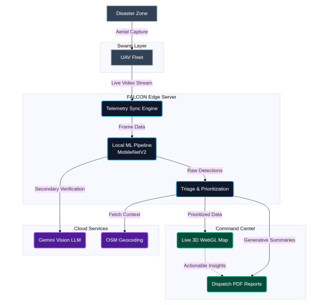

# Autonomous Drone based Damage mapping
A real-time disaster damage assessment system that uses simulated drone footage to map and prioritize damaged areas for first responders.

---

## Overview

After a disaster, ground teams need to know where to go first. This project simulates an autonomous drone surveying an affected area, sending aerial images back to a backend that scores damage severity using a vision ML model. Results are plotted live on a map, color-coded by severity, and ranked into a priority response list.

---

## How It Works

1. A Python script simulates a drone flying a predefined path, sending GPS coordinates
and images to the back-end over a Web Socket connection.
2. The back-end places incoming frames into a SQLite-backed FIFO queue. A background
worker picks them up one at a time and runs inference using a MobileNetV2 model
fine-tuned on the RescueNet/xBD disaster dataset.
3. Each frame is assigned a damage severity score from 0 to 10 and a damage label (e.g.
structural collapse, flooding, fire).
4. Results are broadcast to the front-end in real time. The map updates with color-coded
markers and the priority list re-ranks automatically based on severity.

---

## System Design



---

## Severity Scale

| Score | Color | Meaning |
|-------|-------|---------|
| 0 - 3 | Green | Minor or no damage |
| 4 - 6 | Orange | Moderate damage |
| 7 - 10 | Red | Severe damage, respond first |

---

## Tech Stack

| Part | Technology |
|------|------------|
| Frontend | Next.js, Leaflet.js, WebGL |
| Backend | Python, FastAPI, Asyncio |
| Transport | WebSockets, SQLite |
| ML Model | MobileNetV2, PyTorch, TensorFlow |

---

## Getting Started

### Backend

```bash
cd backend
pip install -r requirements.txt
uvicorn main:app --reload
```

### Frontend

```bash
cd frontend
npm install
npm run dev
```
[Model Training and Metrics Link](ml/MODEL_USAGE.md)
---
