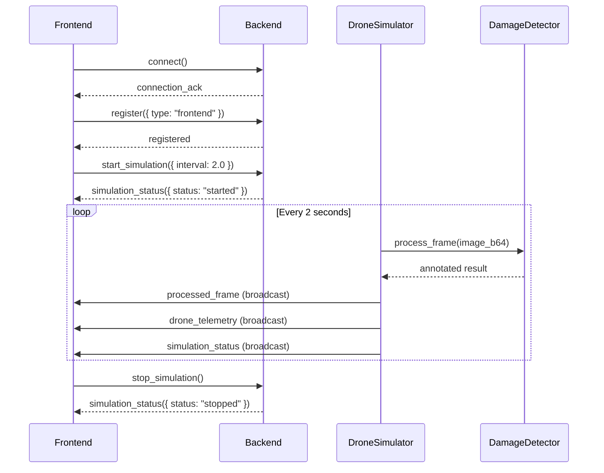
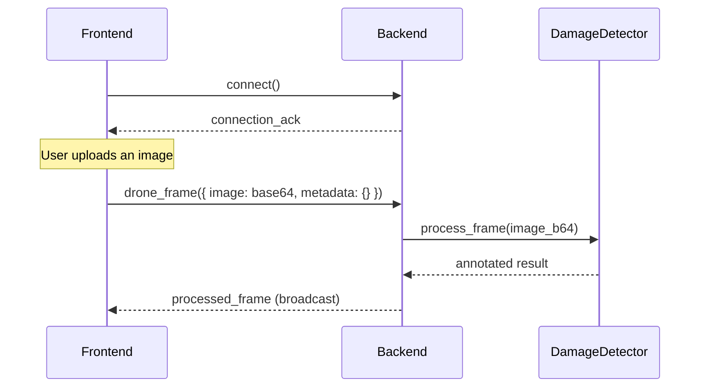
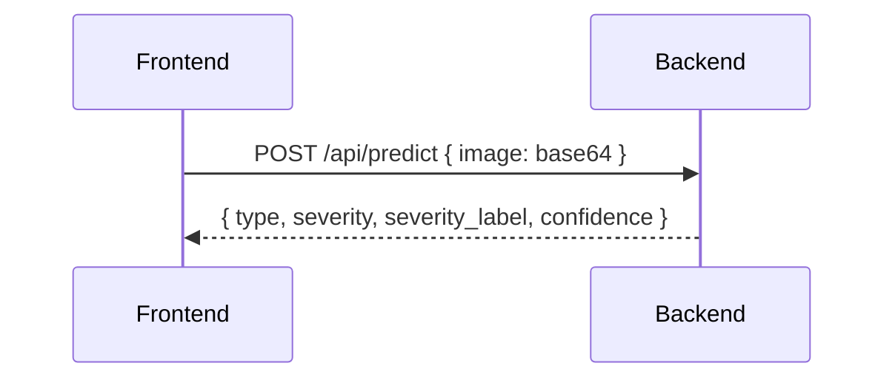

# Skeem Backend API — Frontend Integration Guide

> **Server:** `http://localhost:5001` · **WebSocket:** `ws://localhost:5001`
> **Async mode:** `eventlet` · **Max image payload:** 16 MB

---

## Damage Detection Backends

The server supports two interchangeable damage detection backends, selected at startup via environment variables.

| Variable | Default | Description |
|----------|---------|-------------|
| `USE_GEMINI_FALLBACK` | `0` | Set to `1` / `true` / `yes` to use Gemini Vision API instead of the mock ML model |
| `GEMINI_API_KEY` | _(none)_ | Required when `USE_GEMINI_FALLBACK=1`. Get a key at [aistudio.google.com](https://aistudio.google.com/) |

```env
# .env
USE_GEMINI_FALLBACK=1
GEMINI_API_KEY=your_key_here
```

> [!NOTE]
> If Gemini initialisation fails (missing key, import error), the server automatically falls back to the mock model and logs a warning — it never crashes.

---

## Table of Contents

1. [Connection Setup](#1-connection-setup)
2. [REST Endpoints](#2-rest-endpoints)
3. [WebSocket Events — Emitted by Frontend](#3-websocket-events--emitted-by-frontend)
4. [WebSocket Events — Received by Frontend](#4-websocket-events--received-by-frontend)
5. [Data Schemas](#5-data-schemas)
6. [Damage Categories & Severity Scale](#6-damage-categories--severity-scale)
7. [Typical Flows](#7-typical-flows)

---

## 1. Connection Setup

Connect using **Socket.IO v4** (not raw WebSocket).

```js
import { io } from "socket.io-client";

const socket = io("http://localhost:5001", {
  transports: ["websocket"],
  reconnection: true,
});
```

> [!IMPORTANT]
> CORS is open (`*`). The server uses `eventlet` async mode — make sure you're using the Socket.IO client, not a plain WebSocket.

---

## 2. REST Endpoints

### `GET /`
Service info.

**Response:**
```json
{
  "service": "Skeem Drone Damage Mapping",
  "status": "online",
  "version": "1.0.0-mvp",
  "websocket": "ws://localhost:5001",
  "endpoints": {
    "health": "/api/status",
    "simulation": "/api/simulation/status"
  }
}
```

---

### `GET /api/status`
Health check + live stats.

**Response:**
```json
{
  "status": "healthy",
  "uptime": 1711612345.67,
  "connected_clients": 2,
  "simulation": { "running": true, "frames_sent": 42, "battery": 87.3, "telemetry": { ... } },
  "ml_model": "GeminiDamageDetector (gemini-2.0-flash)",
  "categories": ["fire", "flood", "destruction", "good"],
  "severity_scale": "1–10",
  "frames_processed": 42
}
```

> `ml_model` reflects the active backend: `"DamageDetector-Mock (fire|flood|destruction|good)"` when using the mock, or `"GeminiDamageDetector (gemini-2.0-flash)"` when Gemini is enabled.

---

### `GET /api/simulation/status`
Quick simulation status check.

**Response:**
```json
{
  "running": true,
  "frames_sent": 42,
  "battery": 87.3,
  "telemetry": { /* DroneTelemtry object — see schema below */ }
}
```

---

### `POST /api/predict`
Single-image damage prediction (outside the WebSocket stream).

**Accepts two formats:**

| Format | Content-Type | Body |
|--------|-------------|------|
| JSON | `application/json` | `{ "image": "<base64 string>" }` |
| File upload | `multipart/form-data` | field name: `image` |

**Response:**
```json
{
  "type": "fire",
  "severity": 7,
  "severity_label": "Severe",
  "confidence": 0.83,
  "total_area_pct": 23.5
}
```

| Field | Type | Description |
|-------|------|-------------|
| `type` | `string` | `"fire"` \| `"flood"` \| `"destruction"` \| `"good"` |
| `severity` | `int` | `1–10` |
| `severity_label` | `string` | Human-readable severity |
| `confidence` | `float` | Model confidence `0.0–1.0` |
| `total_area_pct` | `float` | Estimated % of image area affected (`0–100`). `0` when type is `"good"`. Populated by Gemini; mock returns `0`. |

**Error (400):**
```json
{ "error": "No image provided. Send JSON {image: base64} or multipart file." }
```

---

## 3. WebSocket Events — Emitted by Frontend

These are the events the **frontend sends** to the server.

### `register`
Register the client type so the server can distinguish frontends from drones.

```js
socket.emit("register", { type: "frontend" });
```

| Field | Type | Values |
|-------|------|--------|
| `type` | `string` | `"frontend"` or `"drone"` |

---

### `drone_frame`
Send a raw image for ML processing. Normally the drone simulator does this automatically, but the frontend can also send images manually (e.g. an upload feature).

```js
socket.emit("drone_frame", {
  image: "<base64-encoded JPEG/PNG>",
  metadata: {
    // optional — any extra context
    lat: 12.9716,
    lng: 77.5946,
    source: "manual_upload"
  }
});
```

| Field | Type | Required | Description |
|-------|------|----------|-------------|
| `image` | `string` | ✅ | Base64-encoded image (JPEG or PNG). **No data URI prefix** — raw base64 only. |
| `metadata` | `object` | ❌ | Arbitrary metadata passed through to the response. |

> [!WARNING]
> Max payload is **16 MB**. Images larger than this will be rejected by the server.

---

### `start_simulation`
Start the built-in drone simulator. The server will begin emitting `processed_frame` and `drone_telemetry` events at the given interval.

```js
socket.emit("start_simulation", { interval: 2.0 });
```

| Field | Type | Default | Description |
|-------|------|---------|-------------|
| `interval` | `float` | `2.0` | Seconds between simulated frames. |

---

### `stop_simulation`
Stop the drone simulator.

```js
socket.emit("stop_simulation");
```

---

### `get_simulation_status`
Request the current simulation status. The server responds with a `simulation_status` event.

```js
socket.emit("get_simulation_status");
```

---

## 4. WebSocket Events — Received by Frontend

These are the events the **frontend listens to**.

### `connection_ack`
Received immediately after connecting.

```js
socket.on("connection_ack", (data) => {
  console.log(data.message);    // "Connected to Skeem Damage Mapping Server"
  console.log(data.client_id);  // unique session ID
});
```

| Field | Type | Description |
|-------|------|-------------|
| `client_id` | `string` | Your Socket.IO session ID |
| `server_time` | `float` | Server Unix timestamp |
| `message` | `string` | Welcome message |

---

### `registered`
Confirmation after `register`.

```js
socket.on("registered", (data) => {
  // data = { client_id: "abc123", type: "frontend" }
});
```

---

### `processed_frame` ⭐
**The main event.** Contains the ML-annotated image and all detection data. Emitted both when the drone simulator runs and when you manually send a `drone_frame`.

```js
socket.on("processed_frame", (data) => {
  // Display the annotated image
  imgElement.src = `data:image/jpeg;base64,${data.image}`;

  // Use detection data for UI
  console.log(data.detections);
  console.log(data.summary);
});
```

**Full payload shape:**

```json
{
  "image": "<base64 JPEG — annotated with bounding boxes & banner>",
  "detections": [
    {
      "id": "a1b2c3d4",
      "label": "fire",
      "confidence": 0.87,
      "severity": 7,
      "severity_label": "Severe",
      "color": "#FF4422",
      "bbox": { "x1": 120, "y1": 80, "x2": 300, "y2": 250 },
      "area_px": 30600,
      "total_area_pct": 23.5
    }
  ],
  "processing_time_ms": 142.3,
  "frame_id": "frame_000001",
  "total_damage_count": 3,
  "summary": {
    "status": "damage_detected",
    "type": "fire",
    "severity": 7,
    "severity_label": "Severe",
    "total_detections": 3,
    "damage_types": { "fire": 3 },
    "max_severity": 8,
    "max_severity_label": "Very Severe",
    "total_area_pct": 23.5
  },
  "drone_metadata": { /* DroneTelemetry — see below */ },
  "timestamp": 1711612345.67
}
```

> [!NOTE]
> When `summary.status` is `"good"`, the `detections` array will be **empty** and the summary will look like:
> ```json
> {
>   "status": "good",
>   "type": "good",
>   "severity": 1,
>   "severity_label": "None",
>   "total_area_pct": 0.0,
>   "message": "No damage detected — area looks good"
> }
> ```

---

### `drone_telemetry`
Emitted alongside every `processed_frame` during simulation. Gives real-time drone flight data.

```js
socket.on("drone_telemetry", (telemetry) => {
  updateMap(telemetry.lat, telemetry.lng);
  updateBattery(telemetry.battery_pct);
});
```

**Payload:** See [DroneTelemetry schema](#dronetelemetry) below.

---

### `simulation_status`
Emitted when simulation state changes (start, stop, per-frame update, battery depleted).

```js
socket.on("simulation_status", (status) => {
  if (!status.running && status.reason === "battery_depleted") {
    showAlert("Drone battery depleted!");
  }
});
```

| Field | Type | Description |
|-------|------|-------------|
| `running` | `boolean` | Is the simulation active? |
| `frames_sent` | `int` | Total frames emitted so far |
| `battery` | `float` | Current battery % (only during run) |
| `elapsed_s` | `float` | Flight time in seconds (only during run) |
| `reason` | `string?` | `"battery_depleted"` when auto-stopped |
| `status` | `string?` | `"started"`, `"stopped"`, `"already_running"`, `"not_running"` (on start/stop responses) |
| `interval` | `float?` | Frame interval in seconds (on start response) |

---

### `error`
Emitted when something goes wrong processing your request.

```js
socket.on("error", (err) => {
  console.error(err.message);
});
```

| Field | Type | Description |
|-------|------|-------------|
| `message` | `string` | Human-readable error description |

---

## 5. Data Schemas

### Detection

| Field | Type | Description |
|-------|------|-------------|
| `id` | `string` | 8-char unique ID |
| `label` | `string` | `"fire"` \| `"flood"` \| `"destruction"` |
| `confidence` | `float` | `0.0 – 1.0` |
| `severity` | `int` | `1 – 10` |
| `severity_label` | `string` | Human-readable severity (see table below) |
| `color` | `string` | Hex color for the damage type |
| `bbox` | `object` | `{ x1, y1, x2, y2 }` — pixel coordinates |
| `area_px` | `int` | Bounding box area in pixels |
| `total_area_pct` | `float` | Estimated % of image area affected (`0 – 100`). Populated by Gemini backend; `0` from mock. |

---

### DroneTelemetry

| Field | Type | Description |
|-------|------|-------------|
| `drone_id` | `string` | Always `"SKEEM-DRONE-01"` |
| `lat` | `float` | Latitude (6 decimal places) |
| `lng` | `float` | Longitude (6 decimal places) |
| `altitude_m` | `float` | Altitude in meters (`30 – 120`) |
| `heading_deg` | `float` | Compass heading (`0 – 360`) |
| `speed_ms` | `float` | Speed in m/s (`2 – 8`) |
| `battery_pct` | `float` | Battery percentage (`0 – 100`) |
| `signal_strength` | `int` | Signal strength (`75 – 100`) |
| `gps_satellites` | `int` | GPS satellites locked (`8 – 14`) |
| `flight_time_s` | `float` | Time since simulation start |
| `frames_sent` | `int` | Total frames sent |
| `timestamp` | `float` | Unix timestamp |

---

## 6. Damage Categories & Severity Scale

### Categories

| Category | Color | Severity Range | Description |
|----------|-------|----------------|-------------|
| `fire` | `#FF4422` | 3 – 10 | Active fire or fire damage |
| `flood` | `#2288FF` | 2 – 9 | Water / flood damage |
| `destruction` | `#FF2266` | 5 – 10 | Collapsed or destroyed structures |
| `good` | `#44CC66` | 1 (fixed) | No damage detected |

### Severity Scale

| Value | Label |
|-------|-------|
| 1 | None |
| 2 | Minimal |
| 3 | Low |
| 4 | Moderate |
| 5 | Significant |
| 6 | High |
| 7 | Severe |
| 8 | Very Severe |
| 9 | Critical |
| 10 | Catastrophic |

---

## 7. Typical Flows

### Flow A — Drone Simulation (Autonomous)



### Flow B — Manual Image Upload



### Flow C — Single Prediction (REST)



> [!TIP]
> **Use Flow A** for the live dashboard experience. **Use Flow B** if the frontend has its own image source. **Use Flow C** for one-off predictions without needing a WebSocket connection.

---

## Quick Reference — Sending an Image

### Via WebSocket (recommended for real-time)

```js
// Convert a File object to base64 and send
function sendImage(file) {
  const reader = new FileReader();
  reader.onload = () => {
    // Strip the data URI prefix — server expects raw base64
    const base64 = reader.result.split(",")[1];
    socket.emit("drone_frame", {
      image: base64,
      metadata: { source: "manual", filename: file.name }
    });
  };
  reader.readAsDataURL(file);
}
```

### Via REST (one-off)

```js
// Option 1: JSON body
const res = await fetch("http://localhost:5001/api/predict", {
  method: "POST",
  headers: { "Content-Type": "application/json" },
  body: JSON.stringify({ image: base64String })
});
const prediction = await res.json();

// Option 2: FormData file upload
const formData = new FormData();
formData.append("image", fileInput.files[0]);
const res = await fetch("http://localhost:5001/api/predict", {
  method: "POST",
  body: formData
});
const prediction = await res.json();
```
