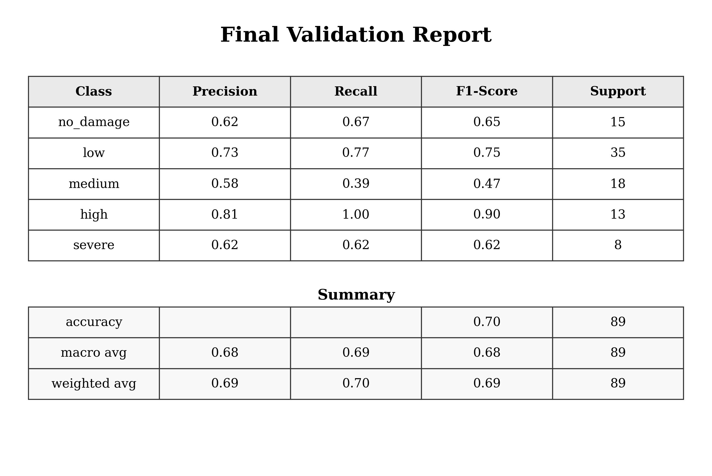
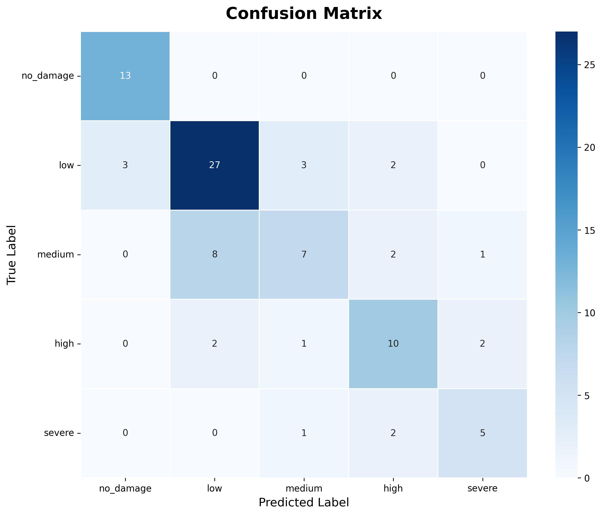
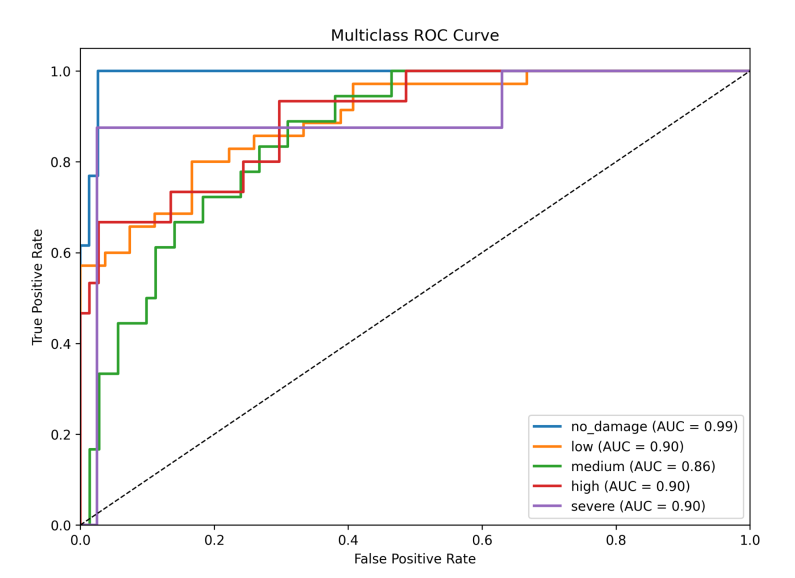

# Damage Classifier Model Documentation

## Overview

The `damage_classifier.pth` model is a disaster damage assessment classifier trained on drone imagery. It uses a fine-tuned **MobileNetV2** neural network to classify building/infrastructure damage into 5 severity levels.

**Model Architecture:**
- **Backbone:** MobileNetV2 (pre-trained on ImageNet)
- **Input Size:** 224×224 RGB images
- **Output Classes:** 5 damage levels
- **Framework:** PyTorch
- **Classifier Head:** Dropout(0.4) → Linear(1280→256) → ReLU → Dropout(0.3) → Linear(256→5)

**Damage Classes (in index order):**

| Index | Label | Icon | Description |
|-------|-------|------|-------------|
| 0 | `no_damage` | 🟢 | No visible structural damage |
| 1 | `low` | 🟡 | Minor damage, structure intact |
| 2 | `medium` | 🟠 | Moderate damage, partial collapse |
| 3 | `high` | 🔴 | Major damage, significant structural loss |
| 4 | `severe` | ⛔ | Total/near-total destruction |

---

## Project Structure

```
coderecet drone/
├── model/
│   ├── train.py              # Training script (MobileNetV2 fine-tuning)
│   ├── predict_app.py        # Local Flask web UI for inference
│   ├── damage_classifier.pth # Trained model weights (~10 MB)
│   ├── class_names.json      # Class name / index mapping
│   ├── templates/
│   │   └── predict.html      # Flask prediction UI template
│   └── uploads/              # Temporarily stores uploaded images
├── hf_space/
│   ├── app.py                # Gradio app for Hugging Face Spaces
│   ├── damage_classifier.pth # Copy of model for HF deployment
│   ├── class_names.json      # Class name / index mapping
│   └── requirements.txt      # HF Space dependencies
├── labeler/
│   ├── app.py                # Flask labeling tool
│   ├── exports/              # Exported label CSVs
│   └── state.json            # Current labeling session state
└── MODEL_USAGE.md            # This file
```

---

## Quick Start

### 1. Installation

Install required dependencies:

```bash
pip install torch torchvision pillow flask
```

For GPU acceleration (optional):
```bash
pip install torch torchvision torchaudio --index-url https://download.pytorch.org/whl/cu118
```

### 2. Basic Usage (Python)

```python
import torch
import torch.nn as nn
import torch.nn.functional as F
from torchvision import models, transforms
from PIL import Image

# ── Configuration ─────────────────────────────────
device = torch.device('cuda' if torch.cuda.is_available() else 'cpu')
model_path = 'model/damage_classifier.pth'
img_size = 224
class_order = ['no_damage', 'low', 'medium', 'high', 'severe']

# ── Build Model ───────────────────────────────────
def build_model(num_classes):
    model = models.mobilenet_v2(weights=None)
    in_features = model.classifier[1].in_features
    model.classifier = nn.Sequential(
        nn.Dropout(0.4),
        nn.Linear(in_features, 256),
        nn.ReLU(),
        nn.Dropout(0.3),
        nn.Linear(256, num_classes),
    )
    return model

# ── Load Model ────────────────────────────────────
model = build_model(len(class_order))
checkpoint = torch.load(model_path, map_location=device)
model.load_state_dict(checkpoint['model_state_dict'])
model.to(device).eval()

# ── Prepare Image ─────────────────────────────────
transform = transforms.Compose([
    transforms.Resize((img_size, img_size)),
    transforms.ToTensor(),
    transforms.Normalize([0.485, 0.456, 0.406], [0.229, 0.224, 0.225]),
])

# ── Run Inference ─────────────────────────────────
img = Image.open('path/to/drone_image.jpg').convert('RGB')
tensor = transform(img).unsqueeze(0).to(device)

with torch.no_grad():
    logits = model(tensor)
    probs  = F.softmax(logits, dim=1).squeeze().tolist()

pred_idx   = int(torch.tensor(probs).argmax())
pred_label = class_order[pred_idx]
confidence = round(probs[pred_idx] * 100, 1)

print(f'Prediction : {pred_label}')
print(f'Confidence : {confidence}%')
print(f'All probs  : { {c: round(p*100,1) for c, p in zip(class_order, probs)} }')
```

**Example output:**
```
Prediction : high
Confidence : 87.3%
All probs  : {'no_damage': 0.4, 'low': 2.1, 'medium': 7.8, 'high': 87.3, 'severe': 2.4}
```

---

## Running the Local Web UI (Flask)

The project includes a full Flask application with a drag-and-drop UI for instant inference.

```bash
cd model/
python predict_app.py
```

Then open **http://localhost:5051** in your browser.

**API Endpoints:**

| Method | Endpoint | Description |
|--------|----------|-------------|
| `GET`  | `/`       | Main prediction UI |
| `POST` | `/predict` | Upload image, get JSON prediction |
| `GET`  | `/status`  | Check if model is loaded |
| `GET`  | `/uploads/<filename>` | Serve uploaded images |

**POST `/predict` — Example Request:**
```bash
curl -X POST http://localhost:5051/predict \
  -F "image=@path/to/drone_image.jpg"
```

**POST `/predict` — Example Response:**
```json
{
  "label": "high",
  "confidence": 87.3,
  "color": "#f97316",
  "icon": "🔴",
  "filename": "a3f1bc...jpg",
  "probabilities": [
    { "class": "no_damage", "prob": 0.4,  "color": "#64748b" },
    { "class": "low",       "prob": 2.1,  "color": "#22c55e" },
    { "class": "medium",    "prob": 7.8,  "color": "#f59e0b" },
    { "class": "high",      "prob": 87.3, "color": "#f97316" },
    { "class": "severe",    "prob": 2.4,  "color": "#ef4444" }
  ]
}
```

> **Note:** Max upload size is 16 MB. Images are temporarily saved to `model/uploads/`.

---

## Hugging Face Spaces (Gradio)

The `hf_space/` directory contains a self-contained Gradio app ready for deployment on [Hugging Face Spaces](https://huggingface.co/spaces).

### Local Testing

```bash
cd hf_space/
pip install -r requirements.txt
python app.py
```

### Deploying to Hugging Face Spaces

1. Create a new Space at https://huggingface.co/new-space (select **Gradio** SDK).
2. Upload all files from `hf_space/` including `damage_classifier.pth`.
3. The Space will auto-install dependencies from `requirements.txt` and launch `app.py`.

**`hf_space/requirements.txt`:**
```
--extra-index-url https://download.pytorch.org/whl/cpu
torch
torchvision
gradio
Pillow
```

> The HF Space runs on CPU by default. The CPU-optimised PyTorch wheel is fetched via the `--extra-index-url` flag to keep install times short.

---

## Training the Model

To retrain on new labelled data, first export labels from the labeler tool, then run:

```bash
cd model/
python train.py
```

### Training Configuration

| Parameter | Value | Description |
|-----------|-------|-------------|
| `IMG_SIZE` | 224 | Input resolution (px) |
| `BATCH_SIZE` | 8 | Batch size (memory-friendly for large drone images) |
| `EPOCHS` | 30 | Number of training epochs |
| `LR` | 1e-4 | AdamW learning rate |
| `SEED` | 42 | Random seed for reproducibility |
| `MAX_PIX` | 1024 | Pre-resize cap before augmentation |

### Training Strategy

- **Backbone freezing:** All MobileNetV2 feature layers frozen except the last 3 blocks, which are fine-tuned.
- **Data split:** Stratified 80/20 train/val split (preserves per-class ratios).
- **Class imbalance:** Weighted `CrossEntropyLoss` using inverse-frequency weights.
- **Optimizer:** AdamW with weight decay `1e-4`.
- **Scheduler:** Cosine Annealing LR over all epochs.
- **Checkpointing:** Best model by validation accuracy is saved immediately to disk during training (avoids RAM spikes from in-memory copies).

### Data Augmentations (Train only)

```python
transforms.RandomHorizontalFlip()
transforms.RandomRotation(15)
transforms.ColorJitter(brightness=0.2, contrast=0.2)
```

Validation uses only resize + normalize (no augmentation).

### Label CSV Format

The training script reads from a CSV exported by the labeler tool:

```csv
filepath,label
D:/path/to/image1.jpg,high
D:/path/to/image2.jpg,no_damage
...
```

Update `CSV_PATH` in `train.py` to point to your export, or re-run the labeler and export a fresh CSV.

### Training Output

After training completes, `train.py` prints a per-class classification report and confusion matrix on the validation set:

```
-- Final Validation Report --
              precision    recall  f1-score   support
   no_damage       0.95      1.00      0.97        19
         low       0.88      0.88      0.88         8
      medium       0.80      0.80      0.80         5
        high       0.86      0.75      0.80         8
      severe       0.86      1.00      0.92         6

    accuracy                           0.89        46

-- Confusion Matrix (rows=true, cols=pred) --
               no_damage         low      medium        high      severe
no_damage             19           0           0           0           0
low                    0           7           0           1           0
medium                 0           0           4           1           0
high                   0           1           1           6           0
severe                 0           0           0           0           6
```

---

## Image Labeling Tool

The `labeler/` directory contains a Flask application for labelling new drone images.

```bash
cd labeler/
pip install -r requirements.txt
python app.py
```

Open **http://localhost:5050** and assign one of the 5 damage labels to each image. Labeled data is saved in `labeler/state.json` and can be exported as a CSV from the UI, ready for use with `train.py`.

---

## Checkpoint Format

The `.pth` checkpoint is a standard PyTorch `state_dict` dictionary saved with `torch.save`. It contains:

```python
{
    'model_state_dict': OrderedDict(...),  # All model weights
    'class_names':  ['no_damage', 'low', 'medium', 'high', 'severe'],
    'class_to_idx': {'no_damage': 0, 'low': 1, 'medium': 2, 'high': 3, 'severe': 4},
    'img_size':     224,
}
```

Load it with:
```python
checkpoint = torch.load('model/damage_classifier.pth', map_location='cpu')
model.load_state_dict(checkpoint['model_state_dict'])
```

---

## Preprocessing Pipeline

All images must go through the same normalisation pipeline used during training:

```python
transforms.Compose([
    transforms.Resize((224, 224)),
    transforms.ToTensor(),
    # ImageNet mean/std normalisation
    transforms.Normalize(
        mean=[0.485, 0.456, 0.406],
        std =[0.229, 0.224, 0.225]
    ),
])
```

> **Important:** Always call `image.convert('RGB')` before applying the transform to handle grayscale or RGBA drone images correctly.

---

## Tips & Troubleshooting

| Issue | Fix |
|-------|-----|
| `RuntimeError: size mismatch` | Ensure you are using `build_model(5)` — model was trained with 5 output classes. |
| `FileNotFoundError: damage_classifier.pth` | Run `python model/train.py` first, or copy the provided `.pth` into `model/`. |
| Low confidence on all classes | Drone images that are very zoomed-out or blurry are edge cases; try cropping the structure. |
| CUDA out of memory during training | Reduce `BATCH_SIZE` in `train.py` (e.g. to 4). |
| Wrong predictions on new imagery | Retrain with additional labelled samples from the new domain using the labeler tool. |
| `ModuleNotFoundError: No module named 'flask'` | Run `pip install flask` (only needed for the local web UI). |

---

## Dependencies Summary

| Package | Purpose |
|---------|---------|
| `torch` | Core deep learning framework |
| `torchvision` | MobileNetV2 pretrained weights + transforms |
| `Pillow` | Image loading and conversion |
| `flask` | Local web UI (`predict_app.py`) |
| `gradio` | Hugging Face Spaces UI (`hf_space/app.py`) |
| `scikit-learn` | Stratified split, classification report (training only) |

## Metric Graphs


